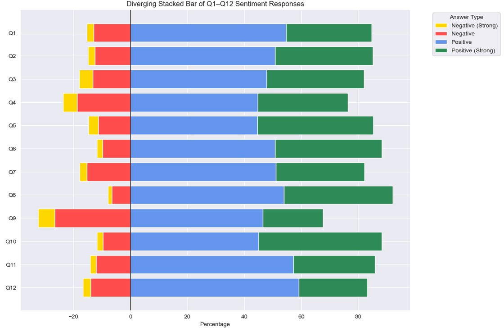
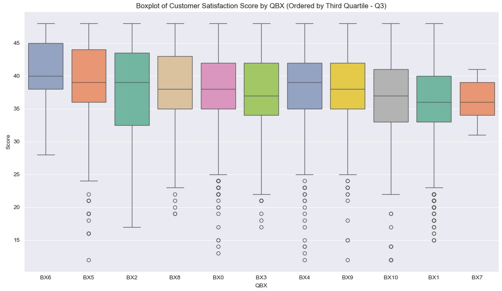
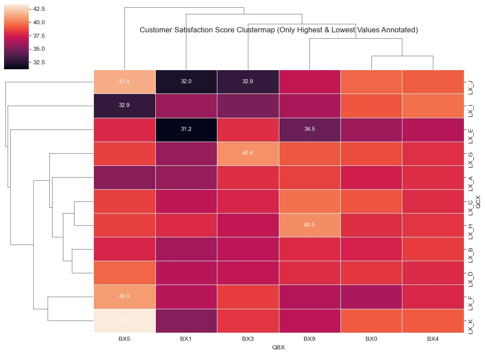

# 🔐 Customer Survey EDA with Anonymized Data

This project demonstrates an exploratory data analysis (EDA) workflow on a large, anonymized customer satisfaction survey. It showcases techniques for working with sensitive data while preserving analytical depth and visual storytelling.

## 📄 License

This project is licensed under the [Creative Commons Attribution-NonCommercial 4.0 International License](https://creativecommons.org/licenses/by-nc/4.0/).  
You are free to use, adapt, and share the materials for **non-commercial purposes**, with proper attribution.

## 🧾 Project Overview

- 💬 7,000+ survey responses
- 📊 12 Likert-scale questions, 1 binary, 2 open-text
- 🧼 Fully anonymized and obfuscated to protect original context
- 📈 Focus on patterns, distributions, and EDA techniques

> 🚨 All data shown here has been anonymized and stripped of real-world identifiers or insights. This project focuses on demonstrating **process and technique** under data privacy constraints.

## 🧪 Goals

- Demonstrate a full EDA workflow on realistic survey data
- Highlight privacy-conscious data handling and anonymization
- Use visualizations to explore trends, sentiment, and engagement

## 🛠️ Techniques Used

- SHA-256 hashing with custom prefixes for identifier obfuscation
- Timestamp shifting to preserve temporal structure
- Free-text entity replacement & POS-based word substitution
- Normalization of Likert-scale responses into sentiment categories
- Pandas, seaborn, matplotlib, nltk/spacy-based text preprocessing

## 🎯 Project Highlights

- Realistic survey data structure with anonymized content
- Custom preprocessing and privacy-preserving pipeline
- Demonstrates transferable skills in survey analytics, sentiment modeling, and data storytelling

## 📬 Contact

Want to chat about privacy-aware analytics or how this kind of workflow could be applied in your team?  
📧 rosic.duro@gmail.com
🌐 https://www.linkedin.com/in/duro-rosic-data-analyst/